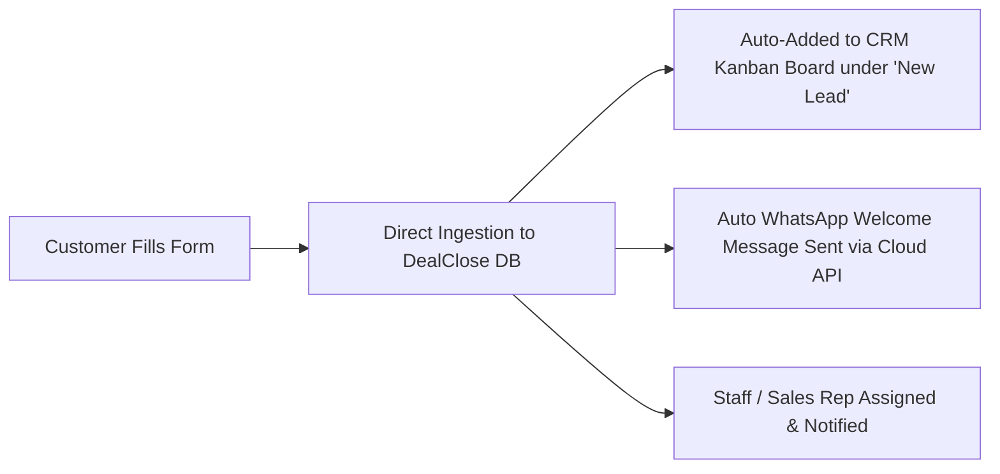

# 📘 DealClose AI: Complete Features, Automation & Permissions Guide

---

## 1. 📝 Forms (Lead Capture & Automation)

### 📌 Yeh Kaise Kaam Karta Hai?
Forms module aapko custom Lead Generation forms banane ki suvidha deta hai jise aap:
1. **Instagram Bio Link:** `dealcloseai.in/forms/your-form-id`
2. **Website Embed:** Iframe ya direct button link
3. **QR Code:** Visiting cards aur shop posters par laga sakte hain.

### ⚡ Iska Automation Flow:

---

## 2. 👥 Staff Management (Team Members, Logins & Permissions)

### 📌 Staff Login & Email Setup:
* **Email & Password:** Owner jab staff add karega (Name, Email, Role, Phone), system staff ke liye MongoDB me user account create karta hai (`role: 'staff'`, `parentOwnerId: ownerId`).
* **Lead Segregation:** Jab staff login karega, usko sirf wahi leads aur chats dikhenge jo uske workspace ya assigned tag se linked hain.
* **Audit Trail (Activity Logs):** Staff ne kab lead ka status badla, kab customer ko message bheja — yeh har lead ke timeline aur chat transcript me timestamp ke saath log hota hai.

---

## 3. 📢 Meta Ads Manager (Retargeting & Custom Audiences)

### 📌 Kya Kaam Karta Hai?
CRM ke high-intent leads (e.g. `Interested` ya `Deal Closed`) ko 1-click me Meta Custom Audience banata hai taaki aap Instagram aur Facebook par unhi leads ko cheap retargeting ads dikha sakein.

### 🔑 Required Permissions & Keys:
| Requirement | Kahan Se Milega? |
| :--- | :--- |
| **Meta App ID & Secret** | Meta for Developers (`developers.facebook.com`) |
| **Permissions Required** | `ads_management`, `ads_read`, `business_management` |
| **System User Token** | Meta Business Suite ➡️ Settings ➡️ System Users (Never Expiring Token) |
| **Ad Account ID** | `act_XXXXXXXXXXXX` (Meta Ads Manager URL se milta hai) |

---

## 4. 🔍 ScanIQ (Vision AI & Competitor Intelligence)

### 📌 Kya Kaam Karta Hai?
Competitor ke visiting cards, rate lists, product brochures ya billboards ki photo kheechne par AI usme se text, mobile numbers, prices aur products automatically extract karke CRM Contacts me save kar deta hai.

### 🔑 Required Permissions & Keys:
| Requirement | Kahan Se Milega? |
| :--- | :--- |
| **Google Gemini API Key** | Google AI Studio (`aistudio.google.com`) - Free Tier |
| **Vision Model** | `gemini-3.5-flash` / `gemini-3.5-flash-lite` (Multimodal Vision Engine) |

---

## 5. 📣 Campaigns (WhatsApp Bulk Broadcast)

### 📌 Kya Kaam Karta Hai?
Apne customer database ko segment karke (e.g. "Festival Offer", "Re-engagement", "New Product Launch") hazaron customers ko 1-click me WhatsApp message bhejna.

### 🔑 Required Permissions & Keys:
| Requirement | Kahan Se Milega? |
| :--- | :--- |
| **Meta WhatsApp Cloud API Token** | Meta Developer Portal ➡️ WhatsApp ➡️ API Setup |
| **Phone Number ID & WABA ID** | WhatsApp Business Account (WABA) Dashboard |
| **Approved Meta Templates** | Meta WhatsApp Manager me templates `MARKETING` category me approved hone chahiye |

---

## 🗺️ Complete Sidebar Directory & Use-Cases

| Icon & Name | Category | Primary Function |
| :--- | :--- | :--- |
| **📈 Dashboard** | Overview | Overall business KPIs, active chats, total revenue & AI Assistant |
| **📉 Tracking Analytics** | Analytics | Conversion rate, cost per lead, AI vs Human workload stats |
| **🗓️ Monthly Report** | Reports | Executive summary PDF report of monthly automated sales |
| **📞 Calls** | AI Calling | Real-time Web/Mobile/Twilio AI Voice calling engine |
| **🧠 AI Agent** | AI Training | Business context, prompts, system instructions & FAQs |
| **💬 Chats** | Messaging | Unified WhatsApp & Instagram Live Inbox |
| **⚡ Flow Builder** | Automations | Visual No-Code customer journey & chatbot creator |
| **📜 Templates** | WhatsApp | Official Meta WhatsApp message templates |
| **⚙️ WhatsApp Rules** | Rules | Instant keyword-based automated replies |
| **🤖 Instagram Automation**| Social Growth| Reel/Post auto comment-to-DM lead generation bot |
| **📢 Publisher** | Social Media| Post & Reel planner, scheduler & performance analytics |
| **🎨 Publish Post** | Creative AI | AI Post caption generator and social media publisher |
| **👥 Contacts** | Leads | Complete database of verified phone numbers & users |
| **📋 CRM** | Sales Pipeline| Kanban drag-and-drop lead stage management board |
| **📦 Catalog** | E-Commerce | Product listings, pricing, descriptions & inventory |
| **🚚 Order Dispatch** | Logistics | Order status tracking (`Pending` ➡️ `Packed` ➡️ `Dispatched`) |
| **📝 Forms** | Lead Gen | Shareable link/QR code forms for website & Instagram bio |
| **📢 Meta Ads** | Advertising | 1-click CRM to Meta Custom Audience retargeting sync |
| **🔍 ScanIQ** | Vision AI | OCR & Vision AI for business cards and competitor flyer scan |
| **📣 Campaigns** | Marketing | Bulk WhatsApp marketing broadcasts & announcements |
| **💳 Wallet** | Finance | AI Credits recharge, Razorpay balance & billing ledger |
| **👥 Staff Management** | HR / Roles | Sales agents onboarding, chat routing & access controls |
| **🔐 Settings** | Admin | API credentials, business info & password security |
